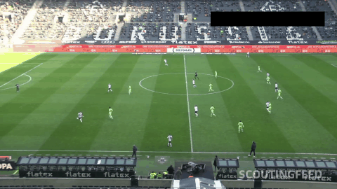
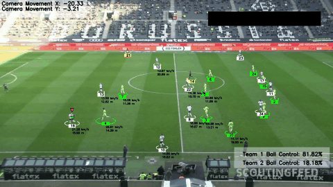
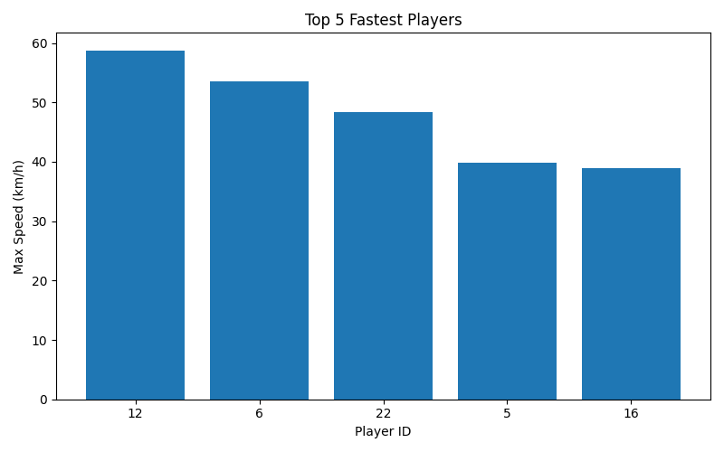
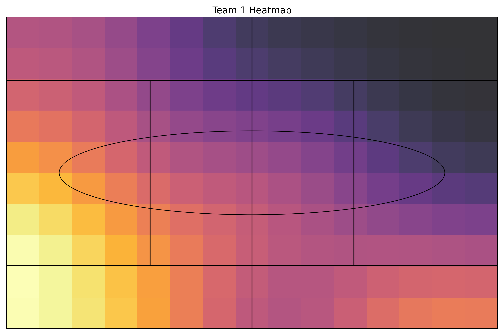
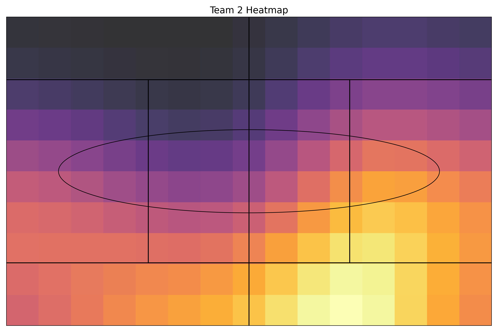
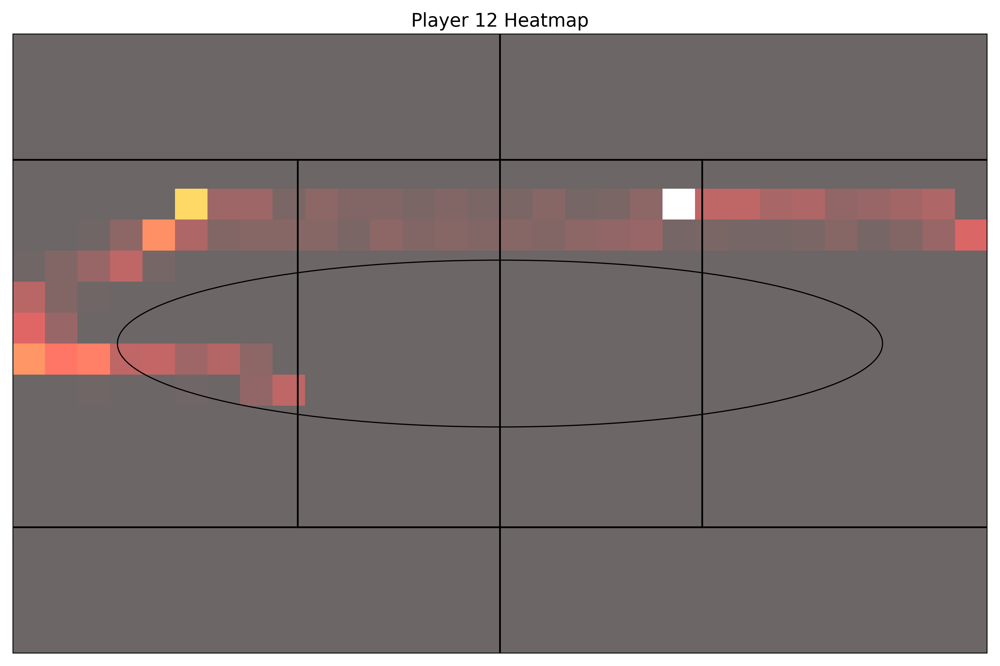

# Football Analysis Tracking System

[](https://www.python.org/)


An end-to-end football video analytics system that performs:
- Player detection & tracking (**YOLO + ByteTrack**)
- Team classification (color-based clustering)
- Ball tracking & possession estimation
- Camera motion compensation
- Advanced analytics (heatmaps, sprint analysis)

Built for scalable sports analytics and tactical insights.

## Results (sample outputs)

### Input vs Output (preview)

| Input (raw video) | Output (tracked + analytics overlays) |
| --- | --- |
|  |  |

### Annotated tracking overlay (video frame)


### Sprint speed analysis (Top 5)



### Team heatmaps





### Player heatmap (example)



## Key Features

- Real-time player tracking with persistent IDs
- Automatic team assignment using color clustering
- Ball tracking with possession analysis
- Perspective transformation to map players onto the pitch
- Player & team heatmaps
- Sprint, speed, and distance analytics
- Combined analytics dashboard

## Outputs

- **Annotated output video** with:
  - Player + referee tracking (IDs over time)
  - Ball indicator
  - Team ball possession overlay
  - Per-player speed/distance overlays
- **Heatmaps**
  - Per-player heatmaps
  - Per-team heatmaps
- **Sprint / speed analytics**
  - Top-speed bar chart
  - Combined analytics dashboard (speed, distance, sprint counts)

## Quickstart

### 1) Create environment and install dependencies

```bash
python -m venv .venv
source .venv/bin/activate
pip install -r requirements.txt
```

### 2) Add model weights

This repo intentionally does **not** commit `.pt` weights (GitHub file-size limits and reproducibility).

Place your trained YOLO weights here:

- `models/best.pt` (used by default in `main.py`)

### 3) Add an input video

Place a match clip in:

- `input_videos/`

`main.py` currently reads:

- `input_videos/08fd33_4.mp4`

You can swap this filename to your own clip.

### 4) Run the pipeline

```bash
python main.py
```

## Outputs

Generated artifacts are written to:

- `outputs/`
  - `outputs/heatmaps/` (player + team heatmaps)
  - `outputs/top_speeds.png`
  - `outputs/analytics_dashboard.png`
- `output_videos/`
  - `output_video.avi` (annotated video)

Note: videos are ignored by git by default (to keep the public repo small). If you want to track them in git, remove the relevant lines from `.gitignore`—but be mindful of file sizes.

## How it works (high level)

1. **Video ingestion**: read frames with OpenCV (`utils/video_utils.py`)
2. **Detection + tracking**: YOLO detections + ByteTrack tracking (`trackers/tracker.py`)
3. **Position extraction**: foot position for players, center for ball
4. **Camera movement estimation**: estimate and compensate camera motion (`camera_movement_estimator/`)
5. **View transform**: normalize positions into a consistent pitch space (`view_transformer/`)
6. **Ball interpolation**: fill missing ball detections to stabilize possession
7. **Speed & distance**: compute distance covered and speed per player (`speed_and_distance_estimator/`)
8. **Team assignment + possession**: infer teams and compute per-frame control (`team_assigner/`, `player_ball_assigner/`)
9. **Analytics**: heatmaps + sprint analysis dashboards (`heatmap_generator/`, `sprint_analyzer/`)

## Project structure

```
.
├─ main.py
├─ trackers/
├─ team_assigner/
├─ player_ball_assigner/
├─ camera_movement_estimator/
├─ view_transformer/
├─ speed_and_distance_estimator/
├─ heatmap_generator/
├─ sprint_analyzer/
├─ utils/
├─ models/                # (local) YOLO weights (ignored by git)
├─ input_videos/          # (local) raw videos (ignored by git)
├─ output_videos/         # (local) rendered videos (ignored by git)
└─ outputs/               # charts + heatmaps (tracked)
```

## Notes / Tips

- **Performance**: detection runs in batches in `Tracker.detect_frames()` for speed.
- **Reproducibility**: the pipeline can load cached tracking/camera stubs from `stubs/` for faster iteration.
- **Roboflow**: training assets and dataset metadata live under `training/`.

## Tech stack

- **Ultralytics YOLO** (detection)
- **Supervision + ByteTrack** (tracking)
- **OpenCV** (video I/O + rendering)
- **NumPy / Pandas** (data handling)
- **Matplotlib** (charts, dashboards, heatmaps)

## Future Work

- Pass detection and pass network visualization
- Expected Threat (xT) modeling
- Player influence maps
- Tactical formation detection over time
- Real-time deployment

## License

Add a license if you plan to share/extend this publicly (MIT is a common choice).
